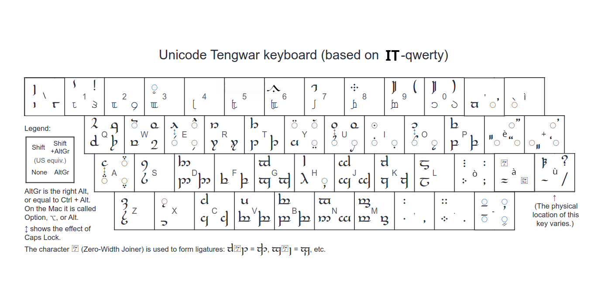

# Layout Tengwar Unicode per tastiere italiane QWERTY

Questo progetto è basato sul lavoro di Free Tengwar Font project, su [freetengwar.sourceforge.net](freetengwar.sourceforge.net).

Il layout "funziona" solo con font adatti (es. Tengwar Telcontar), solo su programmi che supportano la tecnologia Graphite (LibreOffice, OpenOffice, Word).

## Layout


## Installazione

Rendi eseguibile lo script ed eseguilo con i privilegi di amministratore:
```sh
sudo +x install.sh
sudo ./install.sh
```
Verrà anche generato uno script per disinstallarlo.
